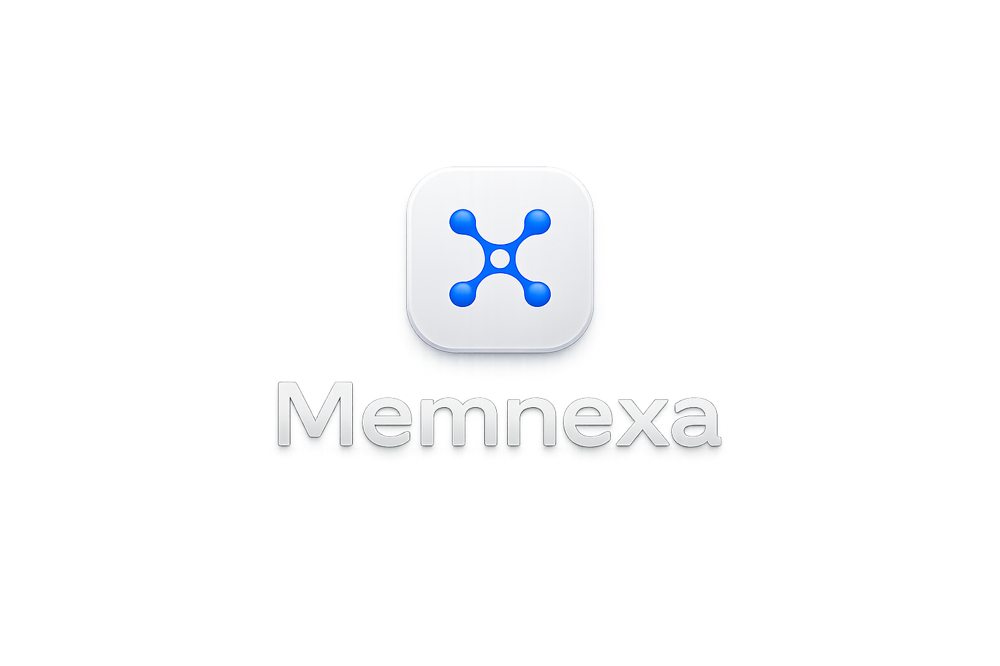
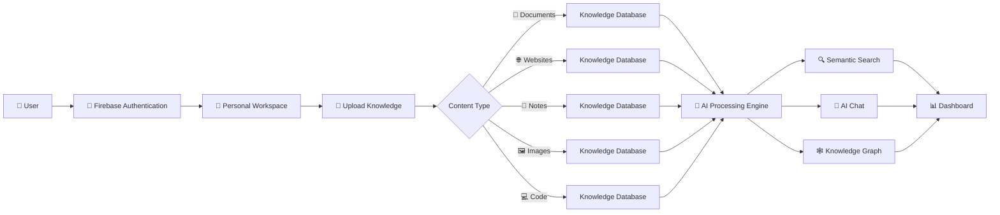
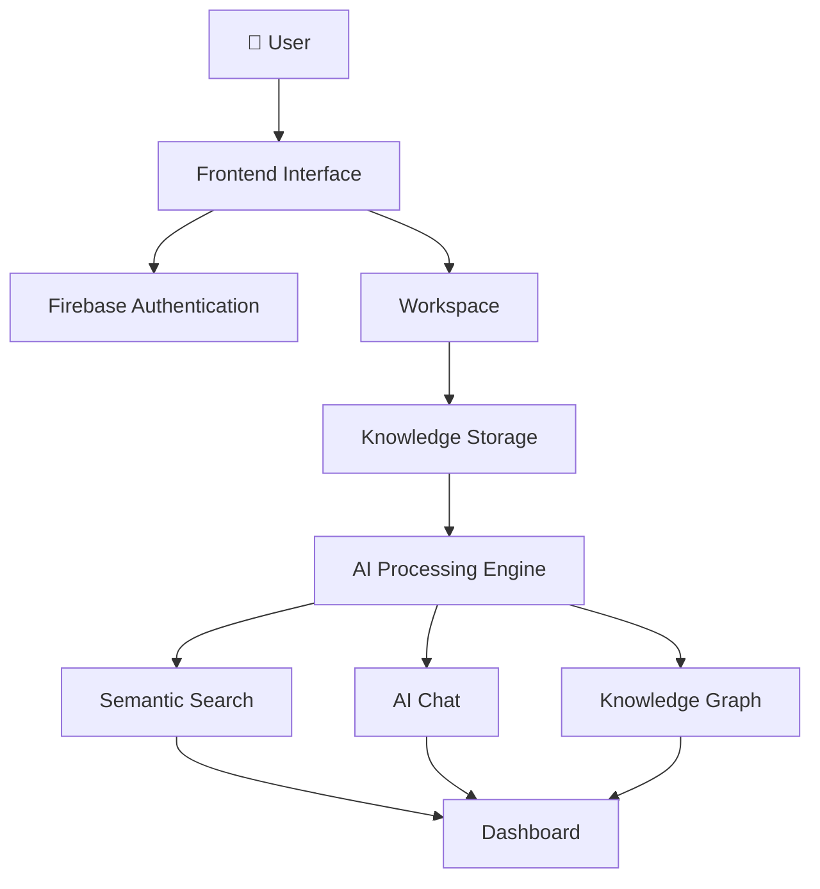

<div align="center">



<br><br>

# 🧠 Memnexa

### Your Personal AI Knowledge Operating System

### Think Smarter. Remember Everything.

Organize documents, websites, notes, images, code, and ideas into one intelligent workspace powered by Artificial Intelligence.

<br>

<a href="#">
    
</a>

<a href="https://github.com/sovanshit/Memnexa">
    
</a>

<a href="#">
    
</a>

<br><br>


</div>

---

# 🌐 Live Website

Experience the future of AI-powered knowledge management.

<div align="center">

<a href="#">


</a>

</div>

---

# 📖 About

**Memnexa** is a modern AI-powered Personal Knowledge Operating System designed to help users capture, organize, search, and interact with their digital knowledge in one unified workspace.

Whether you're managing documents, saving websites, writing notes, storing code snippets, or organizing research, Memnexa transforms scattered information into an intelligent knowledge base that grows with you.

Built with modern web technologies and AI-ready architecture, Memnexa provides a fast, secure, and beautiful experience for students, developers, researchers, creators, and professionals.

Unlike traditional note-taking applications, Memnexa is designed to become an intelligent second brain—connecting your knowledge, understanding context, and helping you retrieve information instantly.

---

## ✨ Why Memnexa?

✔ Store everything in one place

✔ Chat with your knowledge

✔ AI-powered search

✔ Organize documents intelligently

✔ Build a personal knowledge graph

✔ Beautiful modern workspace

✔ Fast and responsive interface

✔ Secure authentication

✔ Privacy-focused architecture

---

## 🎯 Objectives

- Build an AI-powered personal knowledge platform.
- Organize digital information intelligently.
- Enable semantic search across saved content.
- Create an interactive AI knowledge assistant.
- Visualize connected knowledge through graphs.
- Provide a clean and responsive workspace.
- Deliver a scalable architecture for future AI features.

---

# 🚀 Development Timeline

| Phase | Duration |
|----------------------------------|-------------------------|
| Project Planning & Research | February 2026 |
| UI / UX Design | March – May 2026 |
| Frontend Development | June – July 2026 |
| Authentication System | August 2026 |
| Backend Development | September 2026 |
| AI Integration | September 2026 |
| Knowledge Processing Engine | September 2026 |
| Testing & Optimization | September – October 2026 |
| Public Release | October 2026 |

**Development Period:** **February 2026 – October 2026**

🌐 **Portfolio:** Live since **May 2025** — regularly updated with projects, internship experience, and new developments.

---

# ✨ Key Features

<table>

<tr>

<td width="50%">

## 🧠 AI Features

- AI Chat Assistant
- Semantic Search
- AI Summaries
- Smart Recommendations
- Knowledge Graph
- Contextual Responses

</td>

<td width="50%">

## 📂 Knowledge Management

- Documents
- Notes
- Websites
- Images
- Code Snippets
- Collections

</td>

</tr>

<tr>

<td>

## ⚡ Productivity

- Smart Workspace
- Recent Activity
- Favorites
- Tags
- Quick Search
- Dashboard

</td>

<td>

## 🌐 Platform

- Responsive Design
- Firebase Authentication
- Dark Mode
- Modern Glass UI
- FastAPI Backend
- Future AI Ready

</td>

</tr>

</table>

---

# ⚙️ Tech Stack

<div align="center">


<br><br>

| Frontend | Backend | Authentication | Tools |
|-----------|----------|----------------|-------|
| HTML5 | FastAPI | Firebase Auth | VS Code |
| CSS3 | Python | Google Sign-In | Git |
| JavaScript | REST API | Firebase SDK | GitHub |

</div>

---

# 🚀 Project Workflow



---

# 📂 Project Modules

| Module | Description |
|---------|-------------|
| 🏠 Landing Page | Beautiful homepage introducing Memnexa and its AI-powered ecosystem. |
| 🔐 Authentication | Secure login and registration using Firebase Authentication. |
| 📊 Dashboard | Central workspace showing recent activity, collections, and quick actions. |
| 📂 Workspace | Manage documents, notes, websites, images, and code snippets. |
| 🤖 AI Chat | Interact with your knowledge using natural language conversations. |
| 🔍 Smart Search | AI-powered semantic search across all stored knowledge. |
| 🕸 Knowledge Graph | Visualize relationships between connected information. |
| 📚 Collections | Organize knowledge into custom workspaces and folders. |
| ⚙ Settings | Manage account, theme, preferences, and integrations. |
| 👤 Profile | Personal account management and user preferences. |

---

# 📌 Core Functionalities

- ✅ AI-Powered Knowledge Management
- ✅ Firebase Authentication
- ✅ Modern Dashboard
- ✅ Smart Workspace
- ✅ Semantic Search
- ✅ AI Chat Assistant
- ✅ Knowledge Graph
- ✅ Document Management
- ✅ Website Bookmarking
- ✅ Code Snippet Storage
- ✅ Responsive Design
- ✅ Modern Glassmorphism UI
- ✅ Dark / Light Theme
- ✅ Fast Loading Interface
- ✅ Scalable Architecture

---

# 📸 Project Screenshots

A quick overview of the Memnexa interface and major modules.

---

## 🏠 Landing Page

The landing page introduces Memnexa with a modern glassmorphism interface, smooth animations, and AI-inspired visuals.


---

## 🔐 Authentication

Secure authentication powered by Firebase with Google Sign-In and Email Authentication.


---

## 📊 Dashboard

A clean workspace providing quick access to documents, collections, AI tools, and recent activity.


---

## 📂 Workspace

Manage PDFs, notes, websites, images, and code snippets from a single intelligent workspace.


---

## 🤖 AI Chat

Chat naturally with your stored knowledge and receive contextual AI-powered responses.


---

## 🔍 Smart Search

Instantly search across your entire knowledge base using intelligent semantic search.


---

## 🕸 Knowledge Graph

Visualize how documents, notes, websites, and ideas connect with each other.


---

# 📂 Project Structure

```text
📦 Memnexa
│
├── 📂 backend
│   ├── main.py
│   └── requirements.txt
│
├── 📂 screenshots
│
├── 📂 assets
│
├── 📜 index.html
├── 📜 styles.css
├── 📜 app.js
├── 📜 config.js
├── 📜 README.md
│
└── Banner.png
```

---

# 🏗 Project Architecture



---

## Folder Description

| Folder | Description |
|---------|-------------|
| 📂 backend | FastAPI backend and API services |
| 📂 assets | Images, icons, and project resources |
| 📂 screenshots | Images used inside the README |
| 📜 app.js | Main frontend application logic |
| 📜 styles.css | Complete UI styling |
| 📜 config.js | Application configuration |
| 📜 main.py | FastAPI server entry point |
| 📜 requirements.txt | Python dependencies |

---

> 📌 Memnexa follows a modular architecture designed for scalability, allowing AI capabilities, workspace management, and knowledge processing to evolve independently while maintaining a clean and maintainable codebase.

---

# 🚀 Installation

Follow these steps to run **Memnexa** locally.

---

## 1️⃣ Clone the Repository

```bash
git clone https://github.com/sovanshit/Memnexa.git
```

---

## 2️⃣ Navigate to the Project

```bash
cd Memnexa
```

---

## 3️⃣ Install Backend Dependencies

```bash
cd backend
pip install -r requirements.txt
```

---

## 4️⃣ Start the Backend Server

```bash
python main.py
```

The backend will start on:

```text
http://127.0.0.1:8000
```

---

## 5️⃣ Start the Frontend

Simply open **index.html** using **Live Server** in VS Code.

or

```text
http://127.0.0.1:5500
```

---

## 6️⃣ Firebase Configuration

Open

```text
config.js
```

Replace the Firebase configuration with your own project credentials.

```javascript
const firebaseConfig = {
  apiKey: "...",
  authDomain: "...",
  projectId: "...",
  storageBucket: "...",
  messagingSenderId: "...",
  appId: "..."
};
```

---

## 7️⃣ Ready to Go

Your local Memnexa workspace is now running.

---

# 🔒 Privacy & Security

Memnexa is designed with a **privacy-first** approach.

Your knowledge belongs to you.

---

## Security Highlights

| Feature | Description |
|---------|-------------|
| 🔐 Firebase Authentication | Secure Google & Email login |
| 📄 Private Knowledge Storage | Personal workspace isolation |
| 🔒 Protected Routes | Authentication required for workspace |
| ⚡ FastAPI Backend | Lightweight and secure API |
| 🌙 Local Preferences | Theme stored locally |
| 🛡 Secure Architecture | Designed for future encrypted storage |

---

## Privacy Principles

✔ User-first architecture

✔ Secure authentication

✔ Personal knowledge ownership

✔ Privacy-focused design

✔ No unnecessary data collection

✔ Future encrypted knowledge storage

---

# 📈 Future Roadmap

The following features are planned for future releases.

| Feature | Status |
|---------|:------:|
| 🤖 AI Chat Assistant | 🚧 In Progress |
| 🕸 Knowledge Graph | 🚧 In Progress |
| 🔍 Semantic Search | 🚧 Planned |
| 📄 PDF Intelligence | 🚧 Planned |
| 🌐 Website Import | 🚧 Planned |
| 📝 Markdown Support | 🚧 Planned |
| 💻 Code Understanding | 🚧 Planned |
| 📷 OCR Image Reading | 🚧 Planned |
| 🎤 Voice Notes | 🚧 Planned |
| 📱 Mobile Application | 🚧 Planned |
| 💻 Desktop Application | 🚧 Planned |
| 🌍 Browser Extension | 🚧 Planned |
| ☁ Cloud Synchronization | 🚧 Planned |
| 👥 Team Workspace | 🚧 Planned |
| 🔗 API Integrations | 🚧 Planned |

---

# 📊 Project Statistics

| Metric | Value |
|---------|------:|
| 💻 Frontend Pages | 15+ |
| 📂 Workspace Modules | 10+ |
| 🔐 Authentication System | Firebase |
| ⚡ Backend | FastAPI |
| 🧠 AI Modules | Coming Soon |
| 🌙 Dark Theme | Yes |
| 📱 Responsive Design | Yes |
| 🔍 Smart Search | Coming Soon |
| 🕸 Knowledge Graph | Coming Soon |
| 🚀 Deployment Ready | Yes |

---

# ⚡ Performance Highlights

| Feature | Status |
|---------|:------:|
| Responsive UI | ✅ |
| Dark Mode | ✅ |
| Modern Glass UI | ✅ |
| Firebase Authentication | ✅ |
| FastAPI Backend | ✅ |
| Mobile Responsive | ✅ |
| Optimized Animations | ✅ |
| AI Integration Ready | ✅ |

---

# 🌍 Browser Compatibility

<div align="center">

| Chrome | Edge | Brave | Opera | Firefox | Safari |
|:------:|:----:|:-----:|:------:|:-------:|:------:|
| ✅ | ✅ | ✅ | ✅ | ✅ | ⚠️ |

</div>

---

# 💡 Why Memnexa?

Today's information is scattered across PDFs, websites, notes, code snippets, screenshots, and bookmarks.

Memnexa brings everything together into one intelligent workspace.

Instead of simply storing information, Memnexa is being built to understand it—connecting related knowledge, enabling natural conversations, and making retrieval effortless.

Whether you're a student, developer, researcher, creator, or professional, Memnexa aims to become your personal AI-powered second brain.

---

# 🤝 Contributing

Contributions are welcome.

Whether it's improving the UI, optimizing performance, fixing bugs, or adding new AI capabilities, every contribution helps make Memnexa better.

---

## Contribution Workflow

```text
Fork Repository
        │
        ▼
Create Feature Branch
        │
        ▼
Commit Changes
        │
        ▼
Push Branch
        │
        ▼
Open Pull Request
```

---

# 👨‍💻 Developer

<div align="center">

# Sovan Shit

### Frontend Developer • AI Enthusiast • MCA Student

Building modern AI-powered web applications focused on productivity, knowledge management, and user experience.

🌐 **Portfolio:** Live since **May 2025** — regularly updated with projects, internship experience, and new developments.

📧 **Email:** sovanshit20@gmail.com

</div>

---

## Responsibilities

- 🎨 UI / UX Design
- 💻 Frontend Development
- ⚡ JavaScript Application Development
- 🔐 Firebase Authentication
- 🐍 FastAPI Backend
- 🧠 AI System Design
- 📚 Knowledge Management Architecture
- 🕸 Knowledge Graph Design
- 📊 Dashboard Development
- 📱 Responsive Design
- ⚙ Performance Optimization

---

# 🏆 Project Highlights

- 🧠 AI Knowledge Operating System
- 🤖 AI Chat Workspace
- 📚 Smart Knowledge Management
- 🔍 Semantic Search
- 🕸 Interactive Knowledge Graph
- 📄 Intelligent Document Management
- 🌐 Website Knowledge Capture
- 📝 Smart Notes Organization
- 📂 Workspace Collections
- 🔐 Firebase Authentication
- ⚡ FastAPI Backend
- 🎨 Modern Glassmorphism Interface
- 🌙 Dark / Light Theme
- 📱 Fully Responsive
- 🚀 Scalable Architecture

---

# 🙏 Acknowledgements

Special thanks to the amazing open-source technologies and communities that make Memnexa possible.

- HTML5
- CSS3
- JavaScript
- Python
- FastAPI
- Firebase
- GitHub
- VS Code
- OpenAI (Future Integration)
- Open Source Community ❤️

---

# 📄 License

This project is developed for **educational, research, and portfolio purposes**.

You are welcome to explore the source code, learn from it, and build upon it for non-commercial use while giving appropriate credit.

---

# 🌍 Live Website

The official public release of **Memnexa** is expected in **October 2026**.

Stay tuned for the launch of your personal AI Knowledge Operating System.

<div align="center">

<a href="#">


</a>

</div>

---

# ⭐ Repository Statistics

<div align="center">


</div>

---

# 💙 Support the Project

If you found **Memnexa** useful or interesting, please consider supporting the project.

⭐ Star the repository

🍴 Fork it

🐞 Report bugs

💡 Suggest new features

🤝 Share it with others

Every contribution and every star motivates future development.

---

<div align="center">

# ⭐ Thank You for Visiting Memnexa

### Building the Future of AI-Powered Personal Knowledge Management

Made with ❤️ by **Sovan Shit**

</div>
